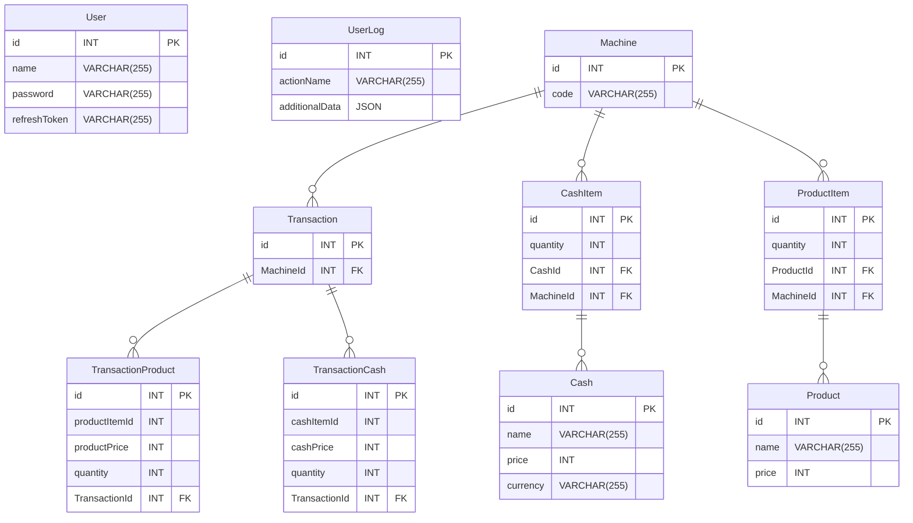

```mermaid
erDiagram
  User {
    id INT PK
    name VARCHAR(255)
    password VARCHAR(255)
    refreshToken VARCHAR(255)
  }

  UserLog {
    id INT PK
    actionName VARCHAR(255)
    additionalData JSON
  }
  
  Machine {
    id INT PK
    code VARCHAR(255)
  }
  Cash {
    id INT PK
    name VARCHAR(255)
    price INT
    currency VARCHAR(255)
  }
  CashItem {
    id INT PK
    quantity INT
    CashId INT FK
    MachineId INT FK
  }
  Product {
    id INT PK
    name VARCHAR(255)
    price INT
  }
  ProductItem {
    id INT PK
    quantity INT
    ProductId INT FK
    MachineId INT FK
  }
  Transaction {
    id INT PK
    MachineId INT FK
  }
  TransactionProduct {
    id INT PK
    productItemId INT
    productPrice INT
    quantity INT
    TransactionId INT FK
  }
  TransactionCash {
    id INT PK
    cashItemId INT
    cashPrice INT
    quantity INT
    TransactionId INT FK
  }

  Machine ||--o{ Transaction : ""
  Machine ||--o{ CashItem : ""
  Machine ||--o{ ProductItem : ""
  Transaction ||--o{ TransactionProduct : ""
  Transaction ||--o{ TransactionCash : ""
  CashItem ||--o{ Cash : ""
  ProductItem ||--o{ Product : ""
```